# AnimaX Lottie Benchmark

Native benchmark runner for comparing [AnimaX](https://github.com/lynx-family/animax) with Airbnb Lottie on Android and iOS under platform profiling tools.

The repository is intentionally client-only:

- Android uses `AnimaXView` or `AnimaXImageView` and `LottieAnimationView` in the same native View host.
- iOS uses `AnimaXView` or `AnimaXImageView` and `LottieAnimationView` in the same UIKit host.
- AnimaX is integrated through published Android Maven artifacts and iOS CocoaPods, not through an in-repository source checkout.
- The active Lottie workload is a single local JSON asset under [assets/lotties](assets/lotties); no test path downloads animation data at runtime.

## What The App Does

The checked-in Android and iOS apps focus on one fixed animation workload rendered at multiple instance counts:

- Android and iOS show x1, x4, x8, and x12 scene buttons.
- Let the user choose AnimaX or Lottie with checkboxes.
- Show AnimaX-only "Enable multi thread" and "Enable image mode" checkboxes. They remain visible in Lottie mode but are disabled. Multi-thread maps to `AnimaXContext.Builder(...).multiThreadAccelerate(...)` on Android and `AnimaXContext.enableMultiThreadAccelerate` on iOS. Image mode creates `AnimaXImageView` instead of `AnimaXView`.
- Android also shows a Lottie-only "Enable async update" checkbox. It remains visible in AnimaX mode but is disabled, and maps to `LottieAnimationView.setAsyncUpdates(...)`.
- iOS forces Lottie to `RenderingEngineOption.mainThread` so the benchmark does not use lottie-ios Core Animation rendering.
- Open a dedicated render page where all animations autoplay and loop.
- Every scene repeats the same local `lotties/heavy_matte_mask.json` animation for each tile. The scene label only changes the number of simultaneous instances.
- Show main-thread FPS for both engines to observe UI-thread smoothness.

Memory is intentionally measured from host-side tooling.

Collect memory, CPU, frame interval, and latency metrics from PC-side tooling such as Android Studio Profiler, Perfetto, Jetpack Macrobenchmark, Xcode Instruments, and XCTest metrics. For release-quality numbers, run on physical devices, release builds, thermal state stable, airplane mode enabled, and fixed display refresh rate when possible. Simulator/emulator runs are useful for smoke tests only.

## Animation Asset And Scenes

The default manifest is [assets/manifest.json](assets/manifest.json). It intentionally contains one generated workload asset rather than a corpus of unrelated sample animations:

- `heavy_matte_mask`: a pure-vector, shape-layer-only animated `ANIMAX` wordmark.
- No fonts, no text layers, no external image assets, and no runtime network loading.
- The JSON is designed to stress mask/matte handling with 15 animated layer masks and 15 animated alpha track matte pairs.
- The matte syntax intentionally uses alpha matte only (`tt: 1`) and ordinary add masks (`mode: "a"`) so the workload stays inside the feature subset supported by both Lottie Android and lottie-ios.
- The benchmark scenes are `x1`, `x4`, `x8`, and `x12`; each scene repeats this same asset across that many tiles.

This setup is meant to isolate renderer behavior under increasing instance count for one mask/matte-heavy animation. It is not intended to represent broad Lottie corpus coverage.

See [assets/README.md](assets/README.md) for provenance notes.

## Android

The Android benchmark project uses Gradle 8.11.1, Android Gradle Plugin 8.9.1, compile SDK 35, and JDK 17 or newer for command-line builds.

AnimaX is consumed from Maven Central-compatible artifacts:

- `org.lynxsdk.lynx:animax-sdk:1.0.0`
- `org.lynxsdk.lynx:animax-textra:1.0.0`

Build and install the Android app:

```sh
cd android
./gradlew :app:assembleNoasanDebug
adb install -r app/build/outputs/apk/noasan/debug/app-noasan-debug.apk
```

Launch an Android scene from the command line:

```sh
../scripts/android_run.sh --engine animax --count 12 --animax-multithread --animax-image-mode
../scripts/android_run.sh --engine lottie --count 12 --lottie-async-updates
```

Android supported instance-count scenes are `1`, `4`, `8`, and `12`.

The Android Lottie dependency defaults to `com.airbnb.android:lottie:6.7.1`, verified from Maven Central.

## iOS

The iOS app uses the published `AnimaX` CocoaPod with the required rendering subspecs, plus `lottie-ios`.

```sh
cd ios/AnimaXBenchmark
./bundle_install.sh
xcodebuild -workspace AnimaXLottieBenchmark.xcworkspace -scheme AnimaXLottieBenchmark -configuration Debug -sdk iphonesimulator -destination 'generic/platform=iOS Simulator' build
```

The default `lottie-ios` version is `4.6.1`.

iOS Lottie scenes intentionally use the main-thread rendering engine (`LottieConfiguration(renderingEngine: .mainThread)`) rather than `.automatic`, so supported animations do not move onto lottie-ios's Core Animation engine.

Run manually from Xcode, or pass launch arguments:

```text
--autorun --engine=animax --count=12 --animax-multithread --animax-image-mode
--autorun --engine=lottie --count=12
```

Use `--engine=lottie` or `--engine=animax` with any supported instance count: `--count=1|4|8|12`.

## Results

The app keeps FPS display in-app and leaves memory, CPU, frame intervals, hitches, and trace analysis to host-side profilers. Performance metrics should come from the PC-side profiler output captured during the same run.

### Android Snapshot Results

The following Android screenshots are stored in [docs/screenshots/android](docs/screenshots/android). They compare:

- AnimaX with multi thread enabled and image mode enabled.
- Lottie Android with async update enabled.
- The same shape-only `lotties/heavy_matte_mask.json` animation repeated across the x1, x4, x8, and x12 scenes.
- Each screenshot is captured after waiting 5 seconds on the render page.

Both columns below are the in-app main-thread FPS values shown after entering the scene.

| Scene | AnimaX screenshot | AnimaX main-thread FPS | Lottie screenshot | Lottie main-thread FPS |
| --- | --- | ---: | --- | ---: |
| x1 | 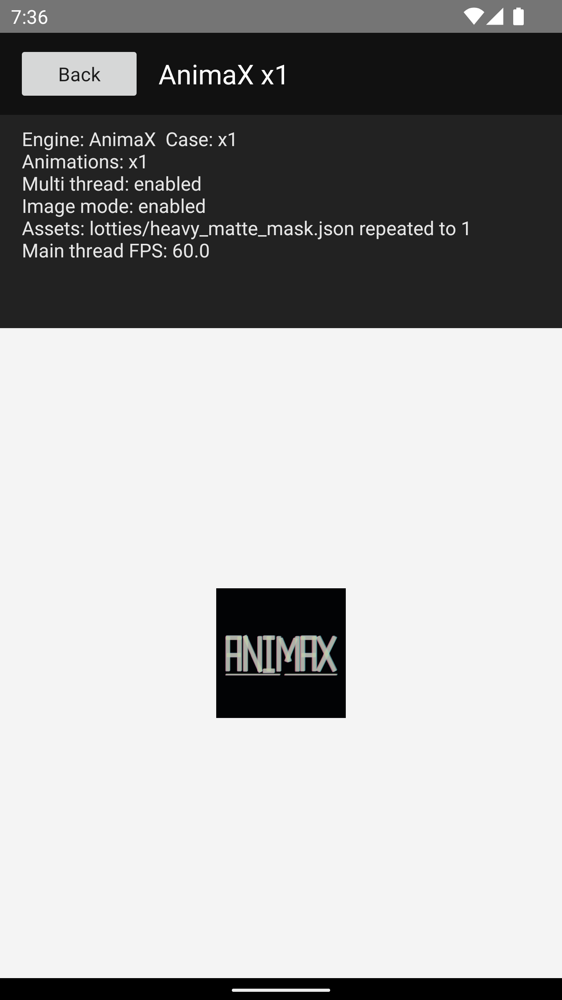 | 60.0 | 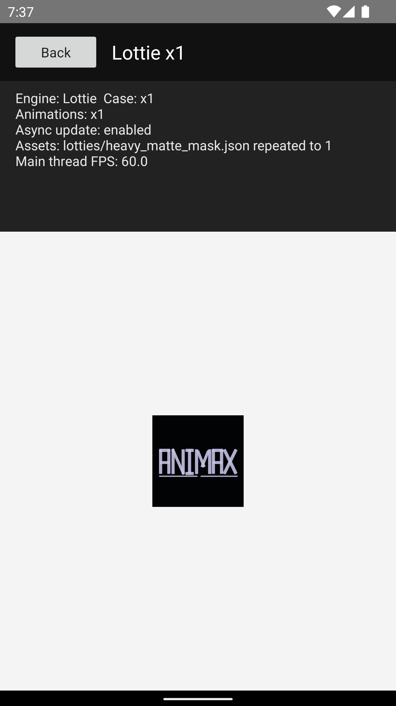 | 60.0 |
| x4 | 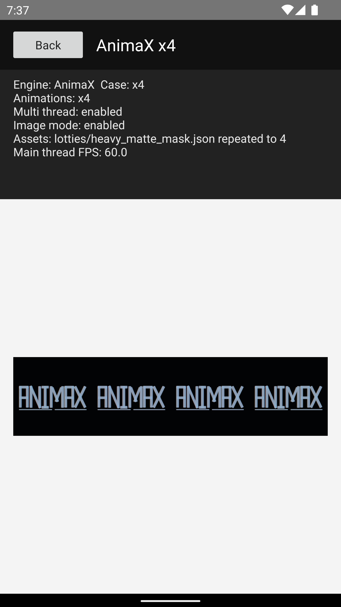 | 60.0 | 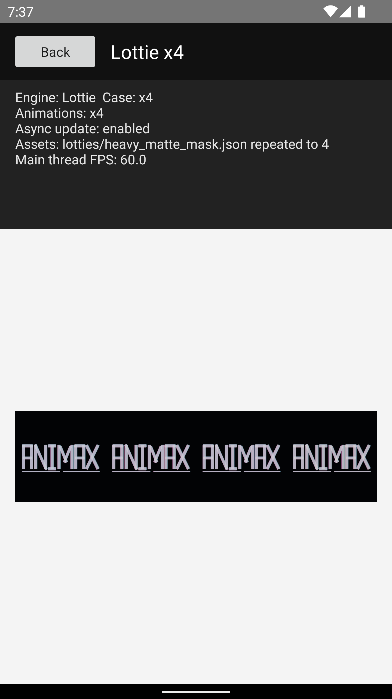 | 60.0 |
| x8 | 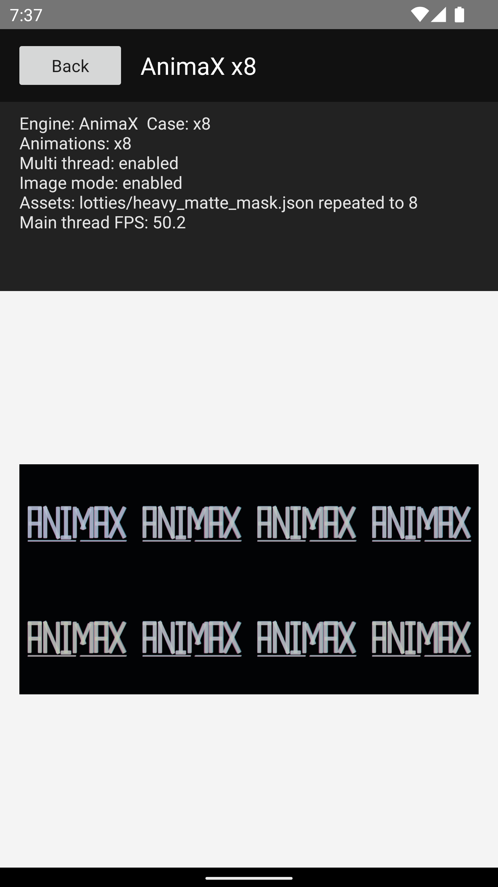 | 50.2 | 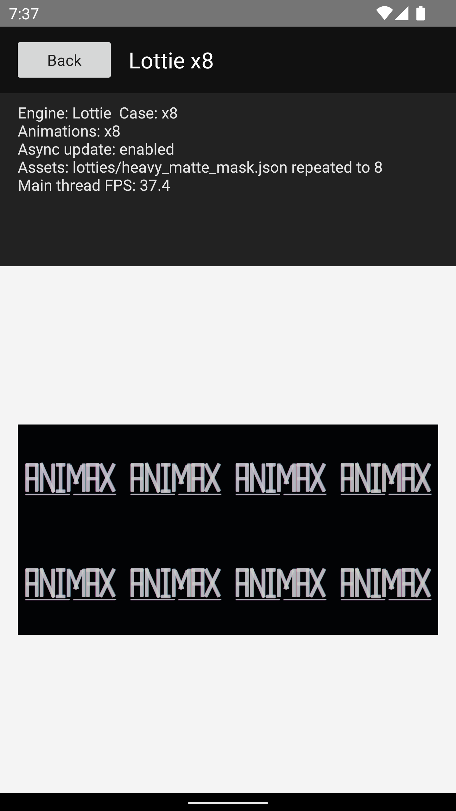 | 37.4 |
| x12 | 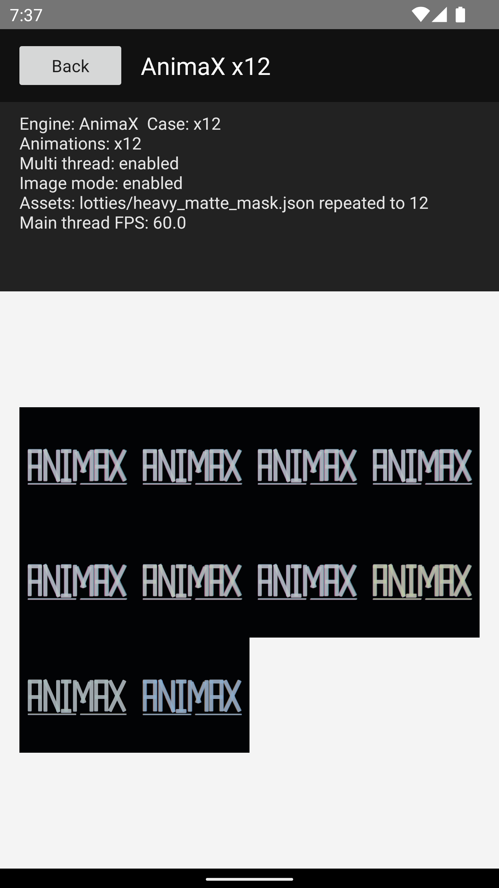 | 60.0 | 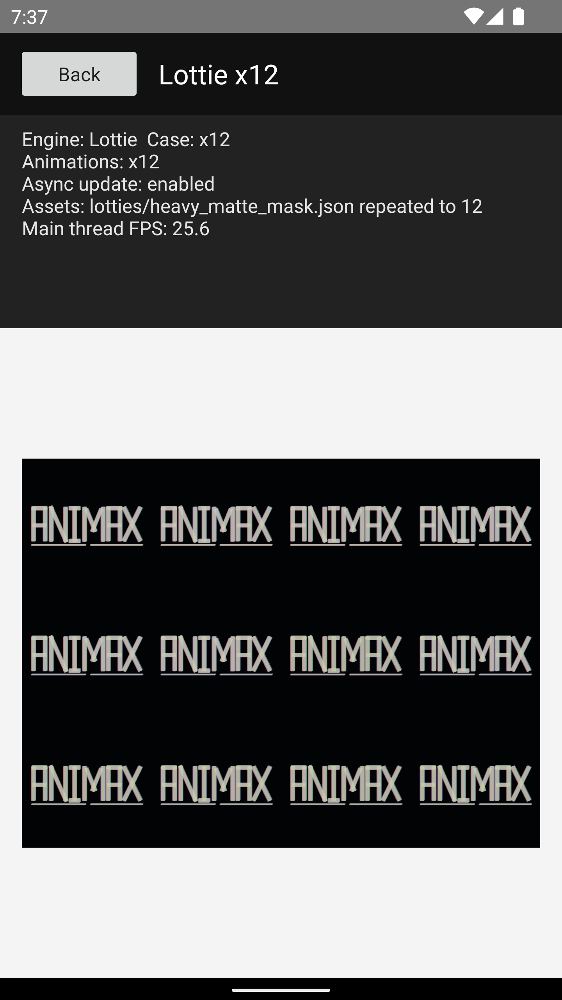 | 25.6 |

Observed from these screenshots:

- AnimaX Android main-thread FPS stays at 60.0 FPS in x1, x4, and x12 in this snapshot; x8 reports 50.2 FPS.
- Lottie Android main-thread FPS drops in the higher instance-count scenes in this snapshot.

### iOS Snapshot Results

The following iOS screenshots are stored in [docs/screenshots/ios](docs/screenshots/ios). They compare:

- AnimaX with multi thread enabled and image mode enabled.
- Lottie iOS pinned to `RenderingEngineOption.mainThread`.
- The same shape-only `lotties/heavy_matte_mask.json` animation repeated across the x1, x4, x8, and x12 scenes.
- Each screenshot is captured after waiting 5 seconds on the render page.

Both columns below are the in-app main-thread FPS values shown after entering the scene. Lottie iOS is pinned to the main-thread rendering engine in this runner.

| Scene | AnimaX screenshot | AnimaX main-thread FPS | Lottie screenshot | Lottie main-thread FPS |
| --- | --- | ---: | --- | ---: |
| x1 | 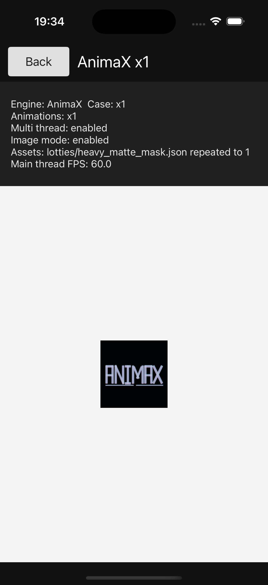 | 60.0 | 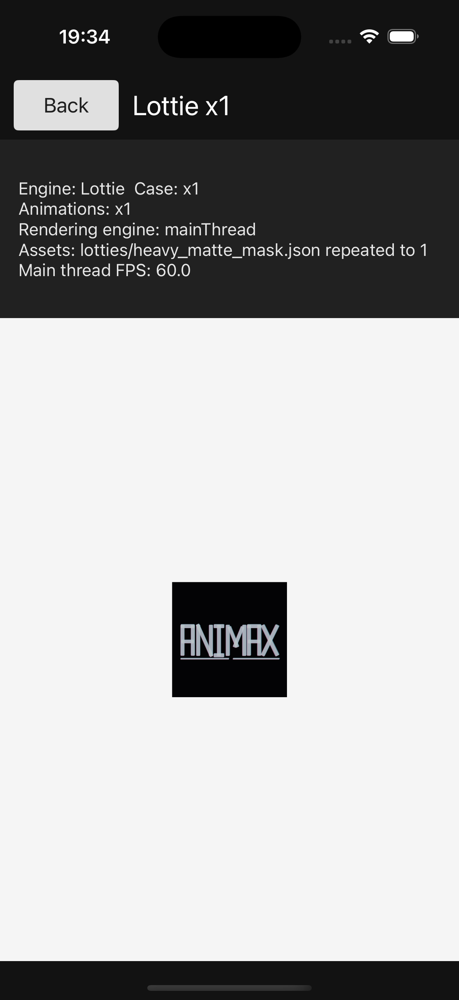 | 60.0 |
| x4 | 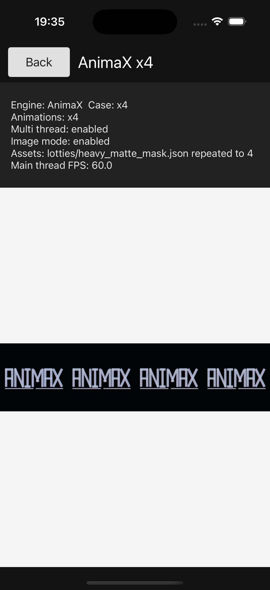 | 60.0 | 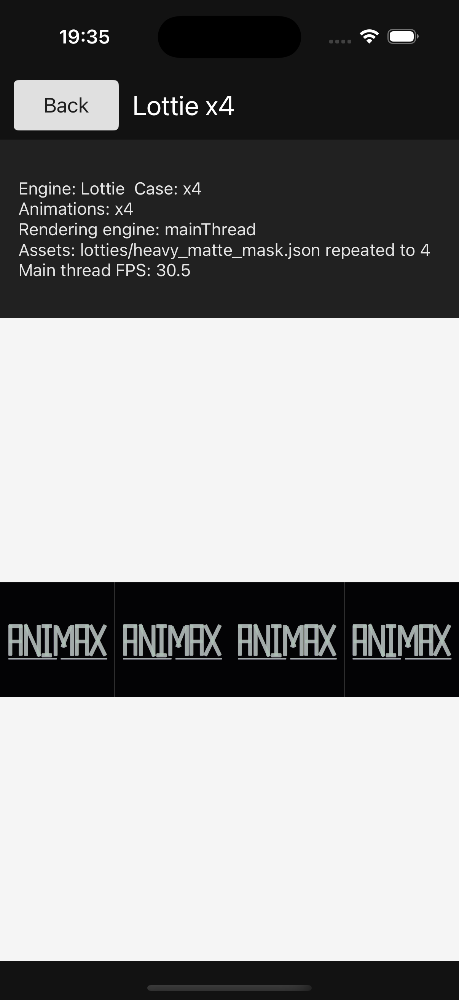 | 30.5 |
| x8 | 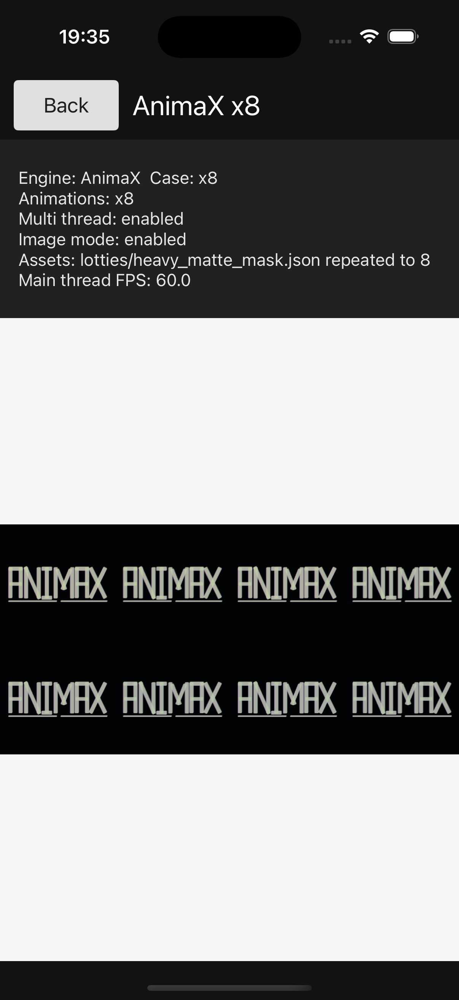 | 60.0 | 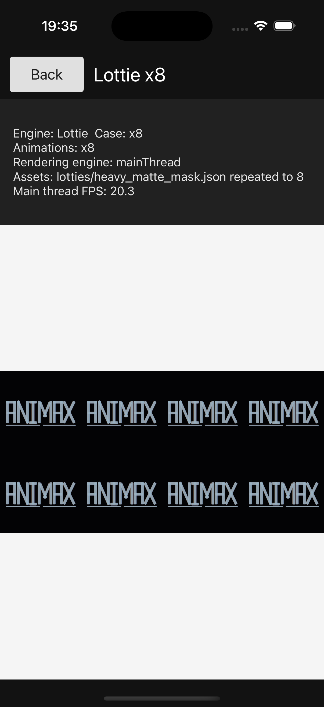 | 20.3 |
| x12 | 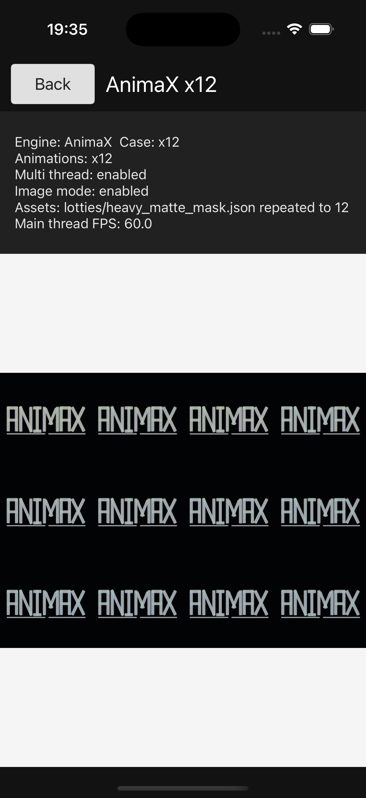 | 60.0 | 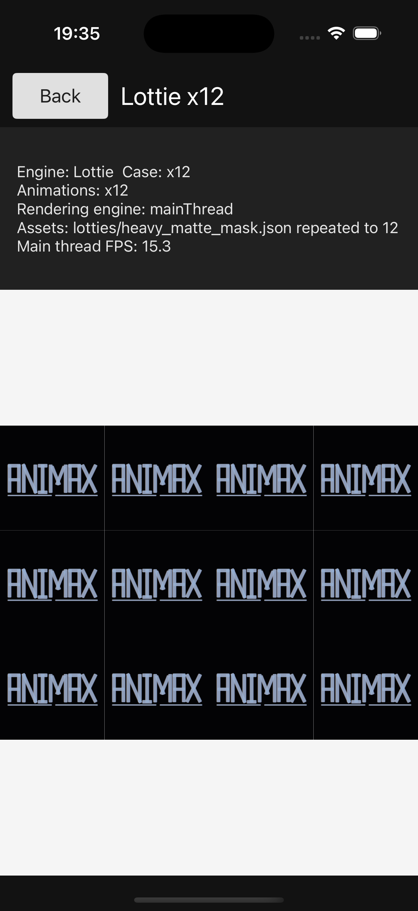 | 15.3 |

Observed from these screenshots:

- AnimaX iOS main-thread FPS stays at 60.0 FPS in all four scenes.
- Lottie iOS main-thread FPS drops in the higher instance-count scenes in this snapshot.
