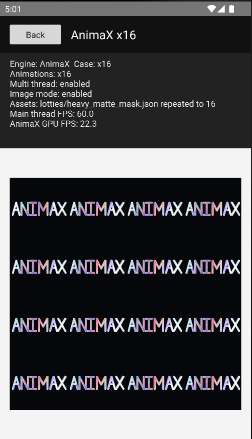
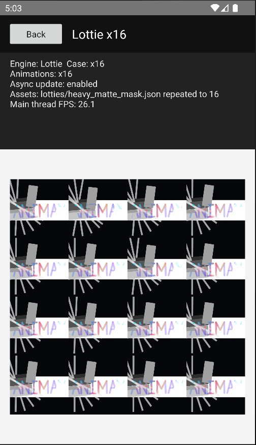
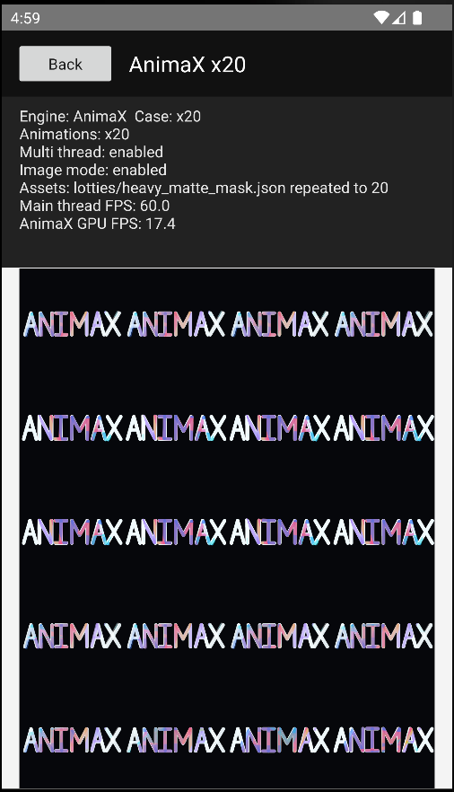
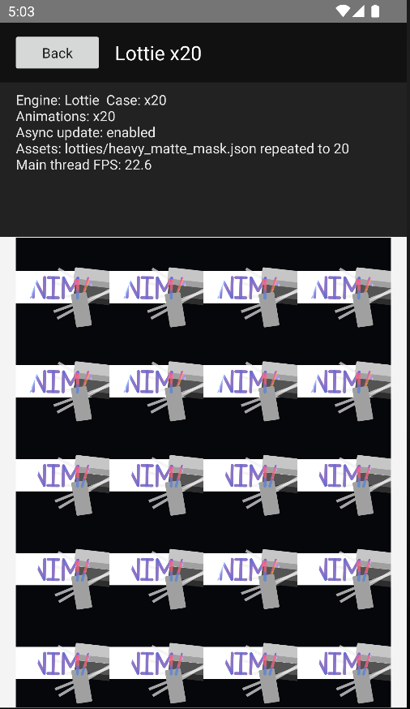

# AnimaX Lottie Benchmark

Native case runner for comparing [AnimaX](https://github.com/lynx-family/animax) with Airbnb Lottie on Android and iOS under platform profiling tools.

The repository is intentionally client-only:

- Android uses `AnimaXView` or `AnimaXImageView` and `LottieAnimationView` in the same native View host.
- iOS uses `AnimaXView` or `AnimaXImageView` and `LottieAnimationView` in the same UIKit host.
- AnimaX is integrated through published Android Maven artifacts and iOS CocoaPods, not through an in-repository source checkout.
- The active Lottie JSON case lives under [assets/lotties](assets/lotties); no test path downloads animation data at runtime.

## What The App Does

The checked-in Android and iOS apps focus on steady-state multi-instance rendering:

- Android and iOS show x8, x12, x16, and x20 buttons.
- Let the user choose AnimaX or Lottie with checkboxes.
- Show AnimaX-only "Enable multi thread" and "Enable image mode" checkboxes. They remain visible in Lottie mode but are disabled. Multi-thread maps to `AnimaXContext.Builder(...).multiThreadAccelerate(...)` on Android and `AnimaXContext.enableMultiThreadAccelerate` on iOS. Image mode creates `AnimaXImageView` instead of `AnimaXView`.
- Android also shows a Lottie-only "Enable async update" checkbox. It remains visible in AnimaX mode but is disabled, and maps to `LottieAnimationView.setAsyncUpdates(...)`.
- Open a dedicated render page where all animations autoplay and loop.
- Every scene repeats the single local `lotties/heavy_matte_mask.json` case for each tile.
- Show main-thread FPS for both engines.
- Show AnimaX GPU/offscreen FPS from `AnimationListenerAdapter.onFPS` on Android and `AnimaXAnimationListener.onFps` on iOS after setting a 1000 ms FPS event interval.

Memory is intentionally measured from host-side tooling.

Collect memory, CPU, frame interval, and latency metrics from PC-side tooling such as Android Studio Profiler, Perfetto, Jetpack Macrobenchmark, Xcode Instruments, and XCTest metrics. For release-quality numbers, run on physical devices, release builds, thermal state stable, airplane mode enabled, and fixed display refresh rate when possible. Simulator/emulator runs are useful for smoke tests only.

## Case

The default case manifest is [assets/manifest.json](assets/manifest.json). It contains one generated shape-only `ANIMAX` wordmark mask/matte stress case:

- `heavy_matte_mask`: pure vector shape layers, no fonts, no text layers, no external assets.
- The animation uses 10 layer masks and 10 track matte pairs.
- The visible subject is a large geometric `ANIMAX` wordmark.

See [assets/README.md](assets/README.md) for provenance notes.

## Android

The Android benchmark project uses Gradle 8.11.1, Android Gradle Plugin 8.9.1, compile SDK 35, and JDK 17 or newer for command-line builds.

AnimaX is consumed from Maven Central-compatible artifacts:

- `org.lynxsdk.lynx:animax-sdk:1.0.0`
- `org.lynxsdk.lynx:animax-textra:1.0.0`

Build and install the Android app:

```sh
cd android
./gradlew :app:assembleNoasanDebug
adb install -r app/build/outputs/apk/noasan/debug/app-noasan-debug.apk
```

Launch an Android scene from the command line:

```sh
../scripts/android_run.sh --engine animax --count 20 --animax-multithread --animax-image-mode
../scripts/android_run.sh --engine lottie --count 12 --lottie-async-updates
```

Android supported count cases are `8`, `12`, `16`, and `20`.

The Android Lottie dependency defaults to `com.airbnb.android:lottie:6.7.1`, verified from Maven Central.

## iOS

The iOS app uses the published `AnimaX` CocoaPod with the required rendering subspecs, plus `lottie-ios`.

```sh
cd ios/AnimaXBenchmark
./bundle_install.sh
xcodebuild -workspace AnimaXLottieBenchmark.xcworkspace -scheme AnimaXLottieBenchmark -configuration Debug -sdk iphonesimulator -destination 'generic/platform=iOS Simulator' build
```

The default `lottie-ios` version is `4.6.1`.

Run manually from Xcode, or pass launch arguments:

```text
--autorun --engine=animax --count=20 --animax-multithread --animax-image-mode
--autorun --engine=lottie --count=12
```

Use `--engine=lottie` or `--engine=animax` with any supported `--count=8|12|16|20`.

## Results

The app keeps FPS display in-app and leaves memory, CPU, frame intervals, hitches, and trace analysis to host-side profilers. Performance metrics should come from the PC-side profiler output captured during the same run.

### Android Snapshot Results

The following Android screenshots are stored in [docs/screenshots/android](docs/screenshots/android). They compare:

- AnimaX with multi thread enabled and image mode enabled.
- Lottie Android with async update enabled.
- The same shape-only `lotties/heavy_matte_mask.json` animation repeated across x8, x12, x16, and x20 scenes.

Lottie Android does not expose a separate animation render FPS in this benchmark. The Lottie main-thread FPS is therefore used as the Lottie animation/render FPS in the table. AnimaX reports both main-thread FPS and `AnimaX GPU FPS`, so the two AnimaX columns should be read as different metrics.

| Case | AnimaX screenshot | AnimaX main-thread FPS | AnimaX GPU/render FPS | Lottie screenshot | Lottie main/render FPS | AnimaX main-thread vs Lottie | AnimaX GPU/render vs Lottie |
| --- | --- | ---: | ---: | --- | ---: | ---: | ---: |
| x8 |  | 60.0 | 39.8 |  | 52.1 | +15.2% | -23.6% |
| x12 |  | 60.0 | 28.2 |  | 37.4 | +60.4% | -24.6% |
| x16 |  | 60.0 | 22.3 |  | 26.1 | +129.9% | -14.6% |
| x20 |  | 60.0 | 17.4 |  | 22.6 | +165.5% | -23.0% |

Observed from these screenshots:

- Lottie Android main/render FPS drops as instance count increases: 52.1 FPS at x8, 37.4 FPS at x12, 26.1 FPS at x16, and 22.6 FPS at x20. From x8 to x20, this is a 56.6% drop.
- AnimaX Android main-thread FPS stays at 60.0 FPS in all four scenes, even at x20. Relative to Lottie main/render FPS, AnimaX main-thread FPS is higher by 15.2% at x8, 60.4% at x12, 129.9% at x16, and 165.5% at x20.
- Averaged across these four screenshots, AnimaX main-thread FPS is 60.0 FPS while Lottie main/render FPS is 34.5 FPS, a 73.7% main-thread FPS advantage for AnimaX.
- AnimaX GPU/render FPS is 39.8, 28.2, 22.3, and 17.4 FPS for x8, x12, x16, and x20 respectively. Compared directly with Lottie main/render FPS, these snapshot values are 14.6% to 24.6% lower, so the strongest conclusion from this screenshot set is main-thread isolation: AnimaX keeps the UI thread full-frame while Lottie main/render FPS degrades under multiple concurrent animations.
